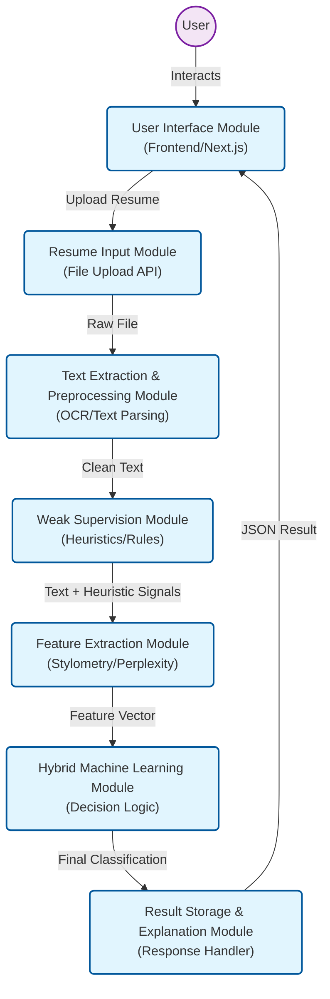

# Research-Grade AI Resume Detector - Architecture

This document outlines the architectural design of the **AI Resume Detector**, adhering to the modular software engineering principles required for the M.Tech dissertation.

## High-Level Architecture Flow

The system follows a linear data processing pipeline designed for high accuracy and explainability.

---

## Module Descriptions

### 1. User Interface Module (Frontend)
-   **Function**: Acts as the presentation layer. It allows users to drag-and-drop resumes and view the "Human vs AI" analysis results with detailed charts.
-   **Technology**: Next.js 16, React, Tailwind CSS.

### 2. Resume Input Module
-   **Function**: Handles the secure transmission of file data from the client to the server. Validates file types (PDF/DOCX) and ensures data integrity.
-   **Component**: `routers/upload.py`

### 3. Text Extraction & Preprocessing Module
-   **Function**: 
    1.  **Extraction**: Converts binary PDF/DOCX data into raw string format.
    2.  **Preprocessing**: Normalizes text by removing stop words, special characters, and excessive whitespace to prepare it for NLP analysis.
-   **Component**: `services/extraction.py`, `services/preprocessing.py`

### 4. Weak Supervision Module
-   **Function**: Applies specific heuristic constraints (rules) to label data without manual tagging. This includes detecting known "AI phrases" (e.g., "delve into") and rigid template structures.
-   **Component**: `services/weak_supervision.py`

### 5. Feature Extraction Module
-   **Function**: Transforms text into numerical vectors.
    -   **Stylometric Features**: Burstiness, Sentence Length Deviation.
    -   **Perplexity**: Uses **DistilGPT2** to measure how "surprised" a standard LLM is by the text (Low surprise = AI).
-   **Component**: `services/features.py`

### 6. Hybrid Machine Learning Module
-   **Function**: The core decision-making engine. It aggregates signals from the Weak Supervision module and the Feature Extraction module to produce a final confidence score.
-   **Component**: `services/model.py`

### 7. Result Storage & Explanation Module
-   **Function**: Formats the classification results into a standard JSON response, providing specific "reasons" for the decision to ensure explainability (XAI).
-   **Component**: `routers/analyze.py` (Response Construction)
