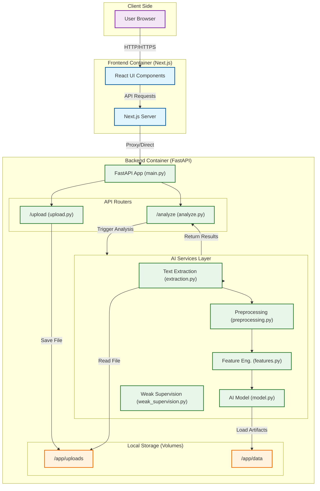

# Resume AI Detector - Architecture Diagram

This document outlines the high-level architecture of the Resume AI Detector application.

## High-Level Overview

The application is composed of a **Next.js Frontend** for user interaction and a **FastAPI Backend** that handles file processing and AI analysis. The backend leverages several internal services for text extraction, preprocessing, feature engineering, and model inference.

## Architecture Diagram

## Component Description

### 1. Frontend (Next.js)
- **Role**: Provides the user interface for uploading resumes and viewing analysis results.
- **Tech Stack**: Next.js 16, React 19, Tailwind CSS.
- **Port**: 3000.

### 2. Backend (FastAPI)
- **Role**: Exposes REST API endpoints to handle resume uploads and run AI inference.
- **Tech Stack**: FastAPI, Torch, Transformers, Scikit-learn.
- **Port**: 8000.

#### Key Modules:
- **Routers**:
    - `upload.py`: Handles file upload and validation.
    - `analyze.py`: Orchestrates the analysis pipeline.
- **Services**:
    - `extraction.py`: Extracts raw text from PDF and DOCX files.
    - `preprocessing.py`: Cleans and normalizes text data.
    - `features.py`: Generates numerical features from text for the model.
    - `model.py`: Loads the trained model and performs inference.

### 3. Data Storage
- **Uploads**: ephemeral storage for uploaded documents (`/backend/uploads`).
- **Data**: persistant storage for model weights, configuration, and potentially training data (`/backend/data`).
