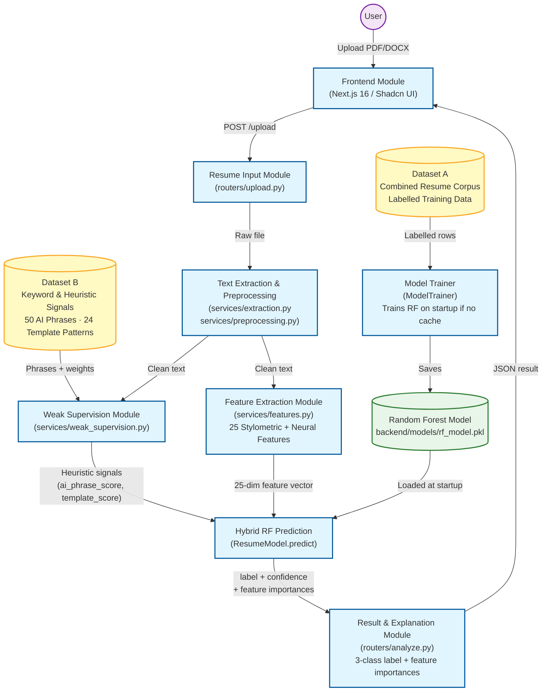

# AI Resume Detector — Architecture

Modular pipeline architecture for the M.Tech dissertation on Weakly Supervised Hybrid ML for AI Resume Detection.

## System Architecture Diagram


```mermaid
graph TD
    User(("User"))
    UI["Frontend Module\n(Next.js 16 / Shadcn UI)"]
    Upload["Resume Input Module\n(routers/upload.py)"]
    Extract["Text Extraction & Preprocessing\n(services/extraction.py\nservices/preprocessing.py)"]

    DatasetB[("Dataset B\nKeyword & Heuristic Signals\n50 AI Phrases · 24 Template Patterns")]
    WeakSup["Weak Supervision Module\n(services/weak_supervision.py)"]

    Features["Feature Extraction Module\n(services/features.py)\n25 Stylometric + Neural Features"]

    DatasetA[("Dataset A\nCombined Resume Corpus\nLabelled Training Data")]
    Trainer["Model Trainer\n(ModelTrainer)\nTrains RF on startup if no cache"]
    RFModel[("Random Forest Model\nbackend/models/rf_model.pkl")]

    Predict["Hybrid RF Prediction\n(ResumeModel.predict)"]
    Response["Result & Explanation Module\n(routers/analyze.py)\n3-class label + feature importances"]

    User -->|"Upload PDF/DOCX"| UI
    UI -->|"POST /upload"| Upload
    Upload -->|"Raw file"| Extract
    DatasetB -->|"Phrases + weights"| WeakSup
    Extract -->|"Clean text"| WeakSup
    Extract -->|"Clean text"| Features
    WeakSup -->|"Heuristic signals\n(ai_phrase_score, template_score)"| Predict
    Features -->|"25-dim feature vector"| Predict
    DatasetA -->|"Labelled rows"| Trainer
    Trainer -->|"Saves"| RFModel
    RFModel -->|"Loaded at startup"| Predict
    Predict -->|"label + confidence\n+ feature importances"| Response
    Response -->|"JSON result"| UI

    classDef module fill:#e1f5fe,stroke:#01579b,stroke-width:2px;
    classDef data fill:#fff9c4,stroke:#f9a825,stroke-width:2px;
    classDef actor fill:#f3e5f5,stroke:#7b1fa2,stroke-width:2px;
    classDef storage fill:#e8f5e9,stroke:#2e7d32,stroke-width:2px;

    class UI,Upload,Extract,WeakSup,Features,Trainer,Predict,Response module;
    class DatasetA,DatasetB data;
    class User actor;
    class RFModel storage;
```

---

## Module Descriptions

### 1. Frontend Module
- **Function**: Drag-and-drop resume upload, confidence gauge, feature importance bar chart, matched phrase display.
- **Technology**: Next.js 16 (App Router), React, Shadcn UI, Tailwind CSS.

### 2. Resume Input Module
- **Function**: Validates file type (PDF/DOCX/TXT), saves to `uploads/`, returns filename for downstream routing.
- **Component**: `routers/upload.py`

### 3. Text Extraction & Preprocessing Module
- **Function**:
  1. **Extraction** — converts binary PDF (`pypdf`) or DOCX (`python-docx`) to raw string.
  2. **Preprocessing** — lowercases, removes stop words, strips special characters, normalises whitespace.
- **Components**: `services/extraction.py`, `services/preprocessing.py`

### 4. Weak Supervision Module
- **Function**: Applies Dataset B heuristics without manual labelling.
  - Scores AI-phrase density using 50 weighted phrases (weights: Very High=1.0 → Low=0.25).
  - Detects template structure using 24 pattern keywords.
  - Emits `ai_phrase_score`, `template_score`, `weak_label`, `weak_confidence`, and matched phrase lists.
- **Data source**: `Dataset_B_Keyword_Heuristic_Signals.xlsx` (with hardcoded fallback).
- **Component**: `services/weak_supervision.py`

### 5. Feature Extraction Module
- **Function**: Produces a 25-dimensional numerical feature vector per resume.
  - **Lexical**: TTR, avg word length, function word ratio, passive voice ratio, comma density.
  - **POS density**: noun, adjective, verb ratios (via Spacy `en_core_web_sm`).
  - **Structural**: bullet count, avg bullet word count, bullet length variance, section count, all-caps ratio.
  - **Neural**: perplexity via DistilGPT2 sliding-window inference.
  - **Readability**: Flesch Reading Ease, Gunning Fog Index, reading time.
  - **Informal signals**: first-person count, informal word count.
  - **Heuristic counts**: AI phrase match count, template pattern match count.
- **Component**: `services/features.py`

### 6. Model Trainer
- **Function**: Loads Dataset A, extracts features for each labelled resume, augments with heuristic counts, trains `RandomForestClassifier(n_estimators=100, class_weight='balanced')`, serialises to `models/rf_model.pkl` and `models/feature_names.json`.
- **Trigger**: Called automatically at startup if no cached model exists (`main.py` startup event).
- **Fallback**: If Dataset A is absent, uses an 11-record synthetic corpus (4 human, 4 AI, 3 template) to bootstrap.
- **Data source**: `Dataset_A_Combined_Resume_Corpus.xlsx`, sheet "Merged Dataset (Training)".
- **Component**: `services/model.py` — `ModelTrainer`

### 7. Hybrid RF Prediction Module
- **Function**: Aligns feature vector to training columns, calls `predict_proba`, maps probabilities to 3-class label (`human_written` / `ai_generated` / `template_based`), generates top-5 feature importances and human-readable reasons.
- **Fallback**: If RF model unavailable, reverts to rule-based weighted scoring.
- **Component**: `services/model.py` — `ResumeModel`

### 8. Result & Explanation Module
- **Function**: Assembles final JSON response with label, confidence, explanation, matched phrases, feature importances, and debug text previews. Ensures explainability (XAI).
- **Component**: `routers/analyze.py`

---

## Data Flow Summary

```
PDF/DOCX
  → Text Extraction
  → Preprocessing (clean text)
  → [Parallel]
      Weak Supervision  ──────────────────────────────┐
      Feature Extraction (25 features)  ───────────── ┤
                                                       ▼
                                         Random Forest predict_proba
                                                       │
                                          3-class label + confidence
                                         + top-5 feature importances
                                                       │
                                              JSON Response → UI
```

## 3-Class Output Labels

| Class | Integer | Meaning |
|---|---|---|
| `human_written` | 0 | Resume authored by a human |
| `ai_generated` | 1 | Resume produced by a language model |
| `template_based` | 2 | Rigid template or AI-assisted tool |
