# Research Paper: System Block Diagram

This block diagram represents the logical flow of the **Weakly Supervised Hybrid Learning System** for AI text detection.

```mermaid
graph LR
    %% Main Block Definitions
    subgraph UI ["USER INTERFACE"]
        direction TB
        B1["Resume Upload"]
        B2["Dashboard View"]
    end

    subgraph PRE ["PRE-PROCESSING UNIT"]
        direction TB
        P1["Text Extraction<br/>(PDF/DOCX)"]
        P2["Noise Removal"]
        P3["Normalization"]
    end

    subgraph WEAK ["WEAK SUPERVISION<br/>(Labeling Functions)"]
        direction TB
        W1["Heuristic Rules"]
        W2["Pattern Matching"]
        W3["Template Detection"]
    end

    subgraph FEAT ["FEATURE EXTRACTION"]
        direction TB
        F1["Stylometry<br/>(Burstiness)"]
        F2["Perplexity<br/>(GPT-2 Model)"]
        F3["Lexical Diversity"]
    end

    subgraph CLF ["HYBRID CLASSIFIER"]
        direction TB
        M1["Logistic Regression"]
        M2["Confidence Scoring"]
        M3["Explainability Geneartor"]
    end

    subgraph OUT ["OUTPUT GENERATION"]
        O1["Classification<br/>(Human vs AI)"]
        O2["Reasoning Report"]
    end

    %% Data Flow Connections
    UI ==> PRE
    PRE ==> WEAK
    WEAK -.->|Heuristic Labels| CLF
    PRE ==> FEAT
    FEAT ==> CLF
    CLF ==> OUT
    OUT -.-> UI

    %% Styling for Research Paper Look (Monochrome/High Contrast)
    classDef block fill:#ffffff,stroke:#000000,stroke-width:2px;
    classDef container fill:#f9f9f9,stroke:#333333,stroke-width:1px,stroke-dasharray: 5 5;
    
    class UI,PRE,WEAK,FEAT,CLF,OUT container;
    class B1,B2,P1,P2,P3,W1,W2,W3,F1,F2,F3,M1,M2,M3,O1,O2 block;
```

## Diagram Description
The architecture consists of five primary processing units:
1.  **Pre-Processing Unit**: Responsible for converting raw files into clean, normalized text.
2.  **Weak Supervision Unit**: Applies programmatic labeling functions to generate noisy labels for training data.
3.  **Feature Extraction Unit**: Computes high-dimensional vectors representing linguistic style and statistical properties (Perplexity).
4.  **Hybrid Classifier**: Combines weak labels and feature vectors to produce a robust final prediction.
5.  **Output Generation**: Returns the final verdict along with interpretable explanations.
